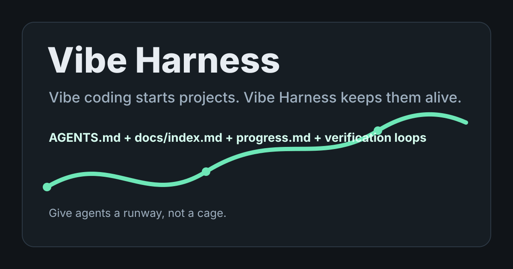

# Vibe Harness

**面向 AI coding 项目的轻量 repo harness。**

[English](README.md) | [简体中文](README.zh-CN.md)

[](https://github.com/myshkin451/vibe-harness/actions/workflows/validate.yml)
[](https://github.com/myshkin451/vibe-harness/releases)
[](LICENSE)



Vibe Harness 是一个可移植的 AI coding skill。它把人的项目规划转译成可持续的 repo 上下文、进度状态、验证闭环和交接规则，让 AI coding 工作可以跨 session、跨 agent、跨工具继续推进。

> 给 agent 跑道，不是给它枷锁。

## 痛点

AI coding 一开始很快，但项目一旦需要记忆、验证和交接，就会开始变脆。

| 之前 | 使用 Vibe Harness 之后 |
| --- | --- |
| 每个新 session 都要重新解释项目。 | `AGENTS.md` 给 agent 一张短地图。 |
| 产品意图只存在聊天记录里。 | `docs/index.md` 路由长期项目上下文。 |
| 没人知道到底验证过什么。 | `progress.md` 记录当前状态和证据。 |
| 多 agent 容易改到同一片文件。 | 工作切片和交接规则定义安全并行。 |
| 文档变成没人维护的长说明书。 | harness 保持轻量、基于证据。 |

Vibe coding 只是这个问题最显眼的一种形态。更底层的需求更宽：任何 AI-coded 项目只要不止一个 session，就需要一个小而稳的项目记忆层。

## 不只适用于 Vibe Coding

这些场景都可以用 Vibe Harness：

- 想从原型走向可维护的小项目
- 用 coding agents 开发的生产级应用
- 团队 repo 里的异步 PR agents
- 过几周还要继续维护的个人项目
- 容易发生上下文漂移和文件冲突的多 agent 工作

只要一个 AI coding 项目未来还会被继续修改、交接、验证或恢复上下文，它就值得有一个 harness。

## 兼容哪些 Agent

Vibe Harness 是平台中立的 Markdown。不同产品的原生 skill 加载方式不一样，但最低集成方式永远是：

```text
Read skills/vibe-harness/SKILL.md and use it to turn this project plan into the lightest useful agent-ready harness.
```

| Agent / 工具 | 最佳用法 | 调用方式 |
| --- | --- | --- |
| Codex | 原生 skill 目录 | `Use $vibe-harness ...` |
| Claude Code | 原生 skill 目录 | `Use the vibe-harness skill ...` |
| Cursor | Project rule 或显式 prompt | `Read skills/vibe-harness/SKILL.md ...` |
| GitHub Copilot Coding Agent | Repo instructions 加显式任务说明 | 在任务里引用 `SKILL.md` |
| Gemini CLI / 其他 coding agents | 可移植 instruction package | 让 agent 读取 `SKILL.md` |

自动触发能力取决于平台。这个 skill 本身只是 Markdown 加模板，所以任何能读文件的 agent 都可以用。

详见 [`docs/compatibility.md`](docs/compatibility.md)。

## 快速开始

克隆仓库：

```bash
git clone https://github.com/myshkin451/vibe-harness.git
cd vibe-harness
```

任何能读文件的 coding agent 都可以直接使用：

```text
Read skills/vibe-harness/SKILL.md and use it with docs/project-plan.md to initialize the lightest useful agent-ready harness for this repo.
```

可选：安装到 Codex 原生 skill 目录：

```bash
mkdir -p ~/.codex/skills
cp -R skills/vibe-harness ~/.codex/skills/vibe-harness
```

然后可以这样调用：

```text
Use $vibe-harness with docs/project-plan.md to initialize the lightest useful agent-ready harness for this repo.
```

可选：安装到 Claude Code 风格的 skill 目录：

```bash
mkdir -p ~/.claude/skills
cp -R skills/vibe-harness ~/.claude/skills/vibe-harness
```

Cursor、Copilot Coding Agent、Gemini CLI 或其他 coding agent 可以直接读取：

```text
skills/vibe-harness/SKILL.md
```

## 审计一个 Repo

Vibe Harness 带了一个静态 audit 脚本，所以它不只是模板包：

```bash
python3 scripts/audit.py /path/to/repo
```

它会检查核心 harness 文件是否缺失、Markdown 链接是否损坏、路径引用是否过期、progress 状态是否缺口、验证命令是否能从 repo 配置里找到明显依据。默认不会执行项目命令。

可以先试一下内置示例：

```bash
python3 scripts/audit.py examples/expected-harness
```

## 它会创建什么

Vibe Harness 会帮助 agent 只创建项目当前真正需要的东西：

- `AGENTS.md`：给 coding agents 的短入口地图
- `docs/index.md`：长期上下文的索引和路由
- `progress.md`：跨 session 的高信号状态板
- 可选 `docs/architecture.md`：当项目边界真的重要时再创建
- 可选 `docs/exec-plans/`：用于长任务或多 agent 协作
- 可选 `docs/decisions/`：记录会影响未来实现的决策
- 诚实的验证路径：命令、浏览器/API/日志证据、CI，或者明确写出当前缺口

## 看一个最小示例

- 输入规划：[`examples/project-plan.md`](examples/project-plan.md)
- 预期 harness：[`examples/expected-harness/`](examples/expected-harness/)
- 3 分钟 demo 脚本：[`docs/demo-script.md`](docs/demo-script.md)

示例 prompt：

```text
Read skills/vibe-harness/SKILL.md and use it with examples/project-plan.md. Create the Seed harness only: AGENTS.md, docs/index.md, and progress.md. Keep unknowns explicit.
```

## 项目类型示例

更多真实项目入口在 [`examples/project-types/`](examples/project-types/)：

- [`personal-site.md`](examples/project-types/personal-site.md)
- [`saas-tool.md`](examples/project-types/saas-tool.md)
- [`backend-api.md`](examples/project-types/backend-api.md)
- [`browser-extension.md`](examples/project-types/browser-extension.md)

## Harness 分层

| 层级 | 适用场景 | 创建内容 |
| --- | --- | --- |
| Seed | 新想法、原型、刚建 repo | `AGENTS.md`、`docs/index.md`、`progress.md` |
| Working | 实现会跨 session 或多 agent | Seed 加 architecture、exec-plan、decision 模板 |
| Mature | 有真实用户、CI、部署或文档漂移 | Working 加 drift checks、runbooks、cleanup loops |

默认从 Seed 开始。项目真的长大了，再让 harness 长大。

## 常用 Prompt

```text
Read skills/vibe-harness/SKILL.md. I have a project plan in docs/project-plan.md. Create only the minimal docs needed so future agents can continue the project safely.
```

```text
Use Vibe Harness to diagnose why agents keep losing context in this repo. Do not add heavy process; find the smallest harness fixes.
```

```text
Use Vibe Harness to refresh AGENTS.md and docs/index.md after this refactor. Ground every claim in current repo evidence.
```

## 为什么现在需要它

Agentic coding 正在从单次 prompt 走向长时间工作。真正有用的模式不再是写一个更长的 mega-prompt，而是给 agent 正确的 repo-local context、验证路径和交接界面。

Vibe coding 是最容易理解的入口，因为它会很快暴露上下文丢失问题；但这个 harness 面向的是更大的类别：AI-assisted engineering、异步 coding agents、多 session 实现和多 agent 协作。

Vibe Harness 受当前跨 coding-agent 工具的 harness/context engineering 趋势启发：

- 一个有影响力的 Codex 案例把 `AGENTS.md` 描述为短地图，深层知识放在结构化 repo docs 中：[Harness engineering](https://openai.com/index/harness-engineering/)。
- 现代 coding-agent workflow 越来越强调：配置好的开发环境、可靠测试、清晰文档、terminal logs 和测试证据：[Introducing Codex](https://openai.com/index/introducing-codex/)。
- Context engineering 认为可靠性的关键是：在正确步骤给模型正确的信息和工具：[Context Engineering for Agents](https://www.langchain.com/blog/context-engineering-for-agents)。

本项目和 Harness.io 无关。这里的 harness 指 agent engineering 语境里的脚手架：让 agents 能稳定工作的上下文、约束和反馈系统。

## 设计原则

- 地图，不是手册。
- 证据，不是仪式。
- 渐进披露，不是上下文洪水。
- 重复提醒不如机械检查。
- 只有工作真的可拆，才加入多 agent 协调。
- 品味、优先级、密钥、破坏性动作和产品方向，仍然保留人类判断点。

## 校验

```bash
python3 scripts/validate.py
```

校验脚本会检查 skill frontmatter、必需文件、本地链接和残留占位符。

## 帮它传播

可以直接使用 [`docs/promotion-kit.md`](docs/promotion-kit.md) 里的中英文文案。

短版：

```text
AI coding moves fast. Vibe Harness keeps projects coherent.

It turns project plans into lightweight agent-ready repos for AI coding: AGENTS.md, docs/index.md, progress.md, verification loops, and multi-agent handoff rules.
```

## 贡献

欢迎贡献，但请保持它轻。先看 [`CONTRIBUTING.md`](CONTRIBUTING.md)。

适合的 first contribution：

- 用一个真实项目规划试用，并提交 before/after harness
- 补一个具体项目类型示例
- 改进模板措辞，但不要让模板变长
- 增加能抓坏链接或 stale commands 的小型 drift check

## License

MIT
